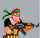

# Contra

# Giới thiệu
Contra là 1 thể loại game nhập vai 2d nổi tiếng cho phép người chơi tấn côn vào các quái vật trên đường đi và đến đích. Đây là 1 phiên bản đơn giản của tựa game trên.

# Bắt đầu
Trên màn hình chỉ việc click vào là có thể vào game

# Cách chơi

- Sử dụng các phím mũi tên **lên**, **xuống**, **trái**, **phải** để di chuyển nhân vật
- Sử dụng phím **SPACE** để bắn đạn vào kẻ thù

# Về các thành phần của game

## Các thành phần trong game
|Thành phần game       |                        |
|:---                  |                    :---|
||  Nhân vật điều khiển           |
|| Quái 
|| Another quái |
|| Tiền |

## Source code
- Game resource: chứa các file âm thanh dùng trong game
- img: chứa các file tạo background, ảnh nhân vật động
- map: chứa các thành phần tạo nên map game
- Source code:
  - commonFile: Tất cả các biến toàn cục dùng chung, một số hàm như kiểm tra va chạm, tạo menu cho game
  - BaseObject: Tất cả các công việc liên quan đến load ảnh, tạo rect, render,... đều được dựng trong file này
  - gameMap: Thực hiện tạo map và lưu dữ liệu đang có của map sao mỗi lần nhân vật tương tác (ăn xu, bắn nhân vật) 
  - MainObject: Thực hiện các công việc tạo nhân vật, di chuyển nhân vật, xử lí va chạm của nhân vật với bản đồ
  - BombObject: File tạo và làm các xử lí liên quan đến đạn bom (chưa hoàn thành)
  - BulletObject: File tạo và thực hiện xử lí liên quan đến đạn bắn trong game
  - ImpTimer: Xử lí các công việc liên quan đến FPS trong game
  - ThreadsObject: Tạo lớp các kẻ địch và các hàm liên quan
  - TextObject: tạo các text hiển thị trên mành hình
  - PlayPower: Những chỉ số liên quan đến nhân vật game: Số mạng còn lại, số tiền nhận được,số điểm hạ quái, ...

## Mã nguồn mở đã tham khảo
[LazyFooProduction](lazyfoo.net)
[Phattrienphanmem123AZ](youtube.com/https://www.youtube.com/@PhatTrienPhanMem123AZ)
[Madsycode](https://www.youtube.com/@Madsycode)

